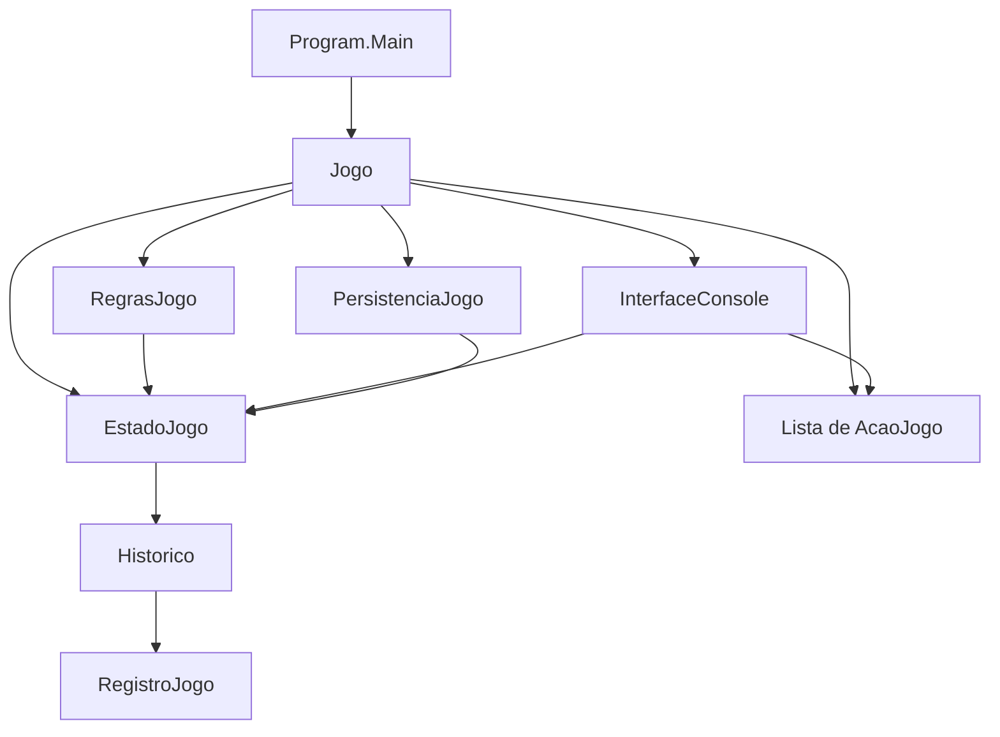
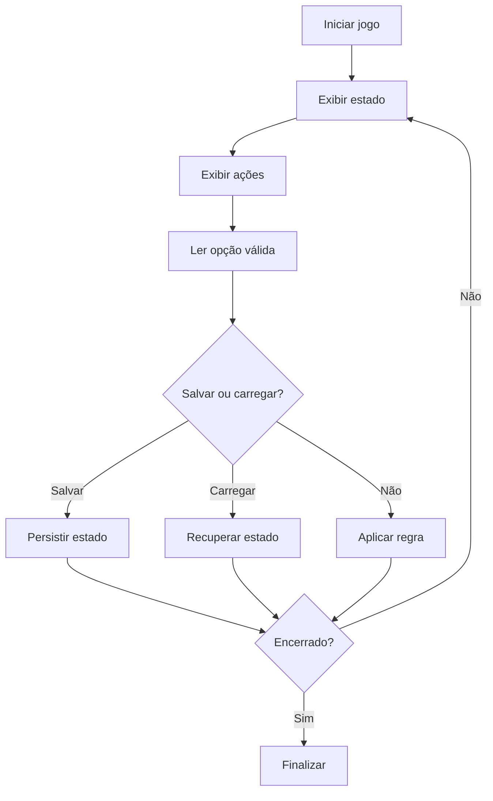
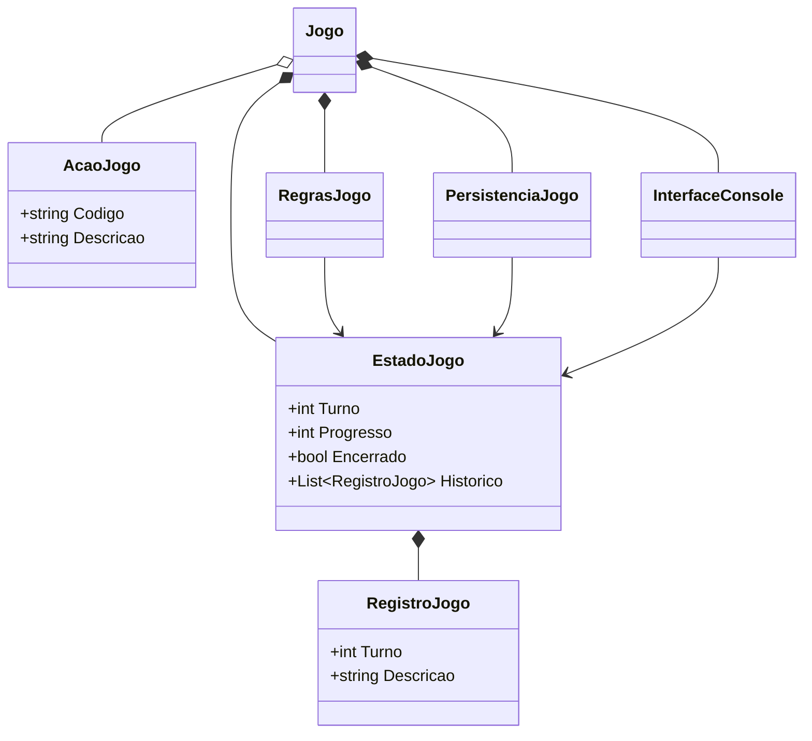

# Arquitetura atual do projeto

Esta página descreve a arquitetura **existente** no projeto-base. Ela não apresenta uma arquitetura idealizada nem antecipa classes que ainda não foram implementadas.

A estrutura foi mantida pequena para que responsabilidades, objetos e relações possam ser identificados por estudantes em uma disciplina introdutória.

## Visão geral

O ponto de entrada cria `Jogo`. A partir daí, a execução é coordenada por poucas classes com responsabilidades distintas.



O diagrama representa dependências conceituais importantes: `Jogo` coordena; `EstadoJogo` mantém dados; `RegrasJogo` altera o estado; `InterfaceConsole` realiza interação; `PersistenciaJogo` salva e recupera o estado.

## Responsabilidades principais

| Elemento | Responsabilidade |
| --- | --- |
| `Program` | iniciar a aplicação |
| `Jogo` | coordenar o ciclo principal e integrar os demais componentes |
| `EstadoJogo` | armazenar os dados mutáveis da partida |
| `AcaoJogo` | representar uma escolha disponível |
| `RegrasJogo` | aplicar consequências ao estado |
| `InterfaceConsole` | apresentar informações e validar entrada textual |
| `RegistroJogo` | representar um acontecimento registrado |
| `PersistenciaJogo` | serializar e desserializar o estado em JSON |

A separação não busca criar muitas camadas. Ela busca evitar que entrada, regras, estado e persistência fiquem misturados em `Program.cs`.

## Ciclo principal

O ciclo atual pode ser representado por:



A interface atual é o console, mas o núcleo do comportamento está nas transições do estado.

## Estado, ação e regra

Uma execução pode ser interpretada como uma sequência de transformações:

```text
Estado atual
+ ação escolhida
+ regra aplicável
= novo estado
```

Por exemplo:

```text
Turno = 1, Progresso = 0
+ ação "Progredir"
+ regra de progresso
= Turno = 2, Progresso = 1
```

A regra também cria um `RegistroJogo`, permitindo manter um histórico de consequências.

## Composição e relações entre objetos

`Jogo` mantém referências para objetos usados durante a execução:



O objetivo do diagrama é ajudar a ler o código atual, não impor uma hierarquia sofisticada.

## Persistência

`PersistenciaJogo` trabalha com `EstadoJogo` como unidade persistida.

```text
EstadoJogo em memória
        ↓ serialização
   savegame.json
        ↓ desserialização
novo EstadoJogo em memória
```

Ao adaptar o projeto, novos dados que realmente fazem parte da partida devem ser incorporados ao estado de forma compatível com esse processo.

## Testabilidade

`RegrasJogo` pode ser usada sem o console. Isso permite criar um `EstadoJogo`, aplicar uma regra e verificar diretamente a consequência.

Essa separação é importante porque regras de negócio são mais fáceis de testar quando não dependem de leitura de teclado ou escrita no terminal.

## Limites intencionais

O projeto não usa, neste estágio:

- interfaces C# para cada serviço;
- herança para ações;
- injeção de dependência;
- banco de dados;
- arquitetura em múltiplas camadas;
- frameworks adicionais.

Esses recursos poderiam ser úteis em sistemas maiores, mas aumentariam a carga conceitual sem necessidade para o objetivo atual.

## Como evoluir sem perder clareza

Ao criar novos elementos, procure manter três perguntas claras:

1. **qual dado esta classe representa ou mantém?**
2. **qual comportamento esta classe executa?**
3. **por que esse comportamento não pertence a uma classe já existente?**

Crie uma nova classe quando surgir uma responsabilidade real. Não crie abstrações apenas para aumentar a quantidade de tipos do projeto.
